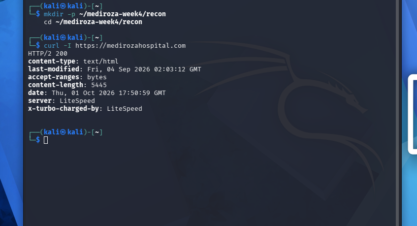
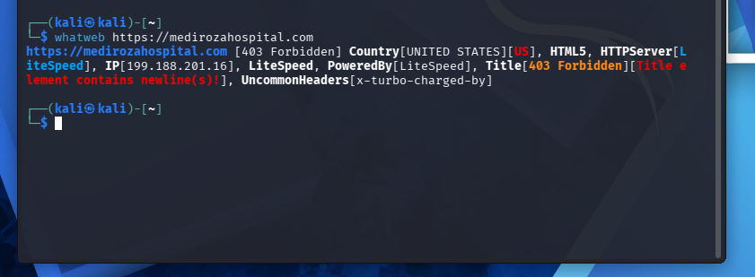
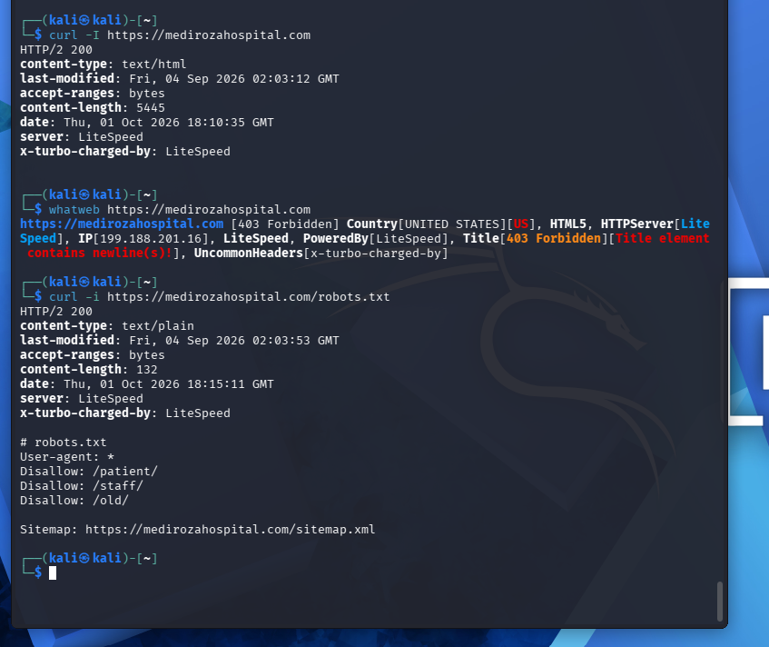
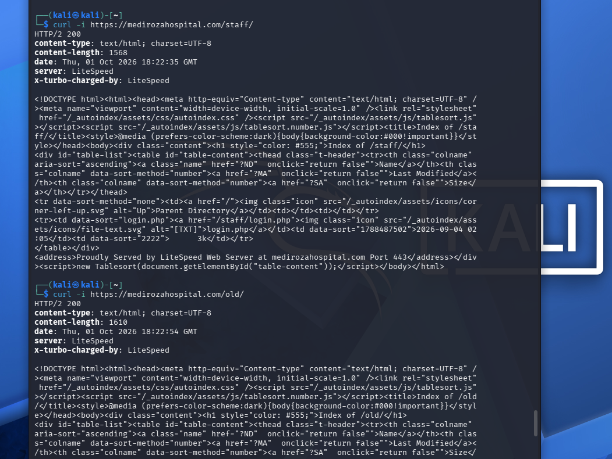
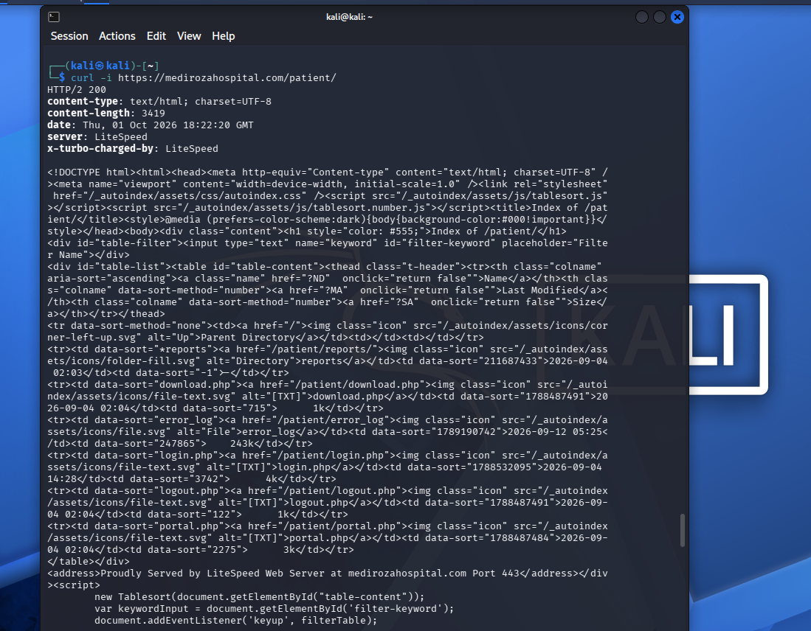

# 🏥 Security Assessment Report: Mediroza General Hospital - Week 4

## 📌 Project Overview

This project details a **comprehensive black-box security assessment** targeting the web infrastructure of Mediroza General Hospital (`https://medirozahospital.com`). 

Operating under a black-box methodology means the assessment was executed with **no prior visibility** into the application's source code, architecture, or internal network. This approach accurately emulates the perspective and knowledge limitations of a real-world external threat actor.

---

### Assessment Lifecycle

This module demonstrates a **full end-to-end penetration testing workflow**:

1. **Information Gathering (Reconnaissance)** — Actively and passively mapping the attack surface to uncover exposed endpoints, hidden directories, and underlying server frameworks.
2. **Vulnerability Discovery** — Pinpointing security flaws within the web application, such as database injection vectors, unprotected sensitive files, and system misconfigurations.
3. **Active Exploitation** — Proving the clinical impact of these flaws by leveraging them to bypass access controls and infiltrate restricted system areas.
4. **Post-Exploitation & Exfiltration** — Accessing and retrieving highly sensitive internal data, including unredacted patient medical records, staff payroll, and shareholder profiles.
5. **Professional Reporting** — Compiling all technical findings into a formal security document complete with risk evaluations and actionable remediation guidance.

### Clinical Impact & Importance

The healthcare sector is entrusted with highly critical data, including Personally Identifiable Information (PII), protected health records, and financial data. This lab illustrates how isolated vulnerabilities—like a weak password or a minor server misconfiguration—can cascade into a **total system compromise**, ultimately exposing the private data of patients, employees, and corporate stakeholders.

---

## 🛠️ Tools & Techniques Used

---

### Tools

| Tool | Application |
|------|---------|
| **curl** | Command-line HTTP client used for manual header inspection, directory traversal, and raw data retrieval. |
| **sqlmap** | Utility for automated detection, validation, and exploitation of database injection flaws. |
| **Hydra** | Parallelized login cracker utilized for brute-forcing targeted authentication portals. |
| **Browser DevTools** | Native browser utilities for inspecting DOM elements, manipulating cookies, and analyzing network requests. |
| **Burp Suite** | Web proxy platform used for intercepting, analyzing, and tampering with in-flight HTTP traffic. |

---

### Techniques

| Technique | Description |
|-----------|-------------|
| **Directory Enumeration** | Systematically fuzzing URL paths to reveal hidden administrative directories and unlinked assets. |
| **SQL Injection (SQLi)** | Inserting malicious query syntax into input fields to bypass authentication and interact directly with backend databases. |
| **Error-Based SQLi** | Forcing the database to throw verbose backend errors to the frontend in order to map database structures. |
| **Credential Brute-Forcing** | Deploying automated dictionary attacks against authentication forms to guess valid account passwords. |
| **Session Hijacking** | Stealing and utilizing active PHP session tokens to masquerade as an authenticated, privileged user. |
| **Sensitive Data Exposure** | Locating and retrieving publicly accessible backup files, database dumps, and configuration data. |
| **Passive Reconnaissance** | Fingerprinting the web server and CMS environment by analyzing HTTP response headers, metadata, and public XML maps. |

---

### Methodology

This assessment utilized a **manual-first approach**, heavily prioritizing hands-on testing and behavioral analysis of the application over automated vulnerability scanners. Automated utilities were deployed strictly to validate findings or scale attacks after manual verification, reflecting industry-standard professional penetration testing practices.

All security testing was strictly confined to the **authorized scope** (`https://medirozahospital.com`) and fully complied with the established Rules of Engagement.

---


## 🔍 Reconnaissance & Information Gathering

This phase focused on active and passive intelligence gathering to map the target's attack surface and isolate viable entry points prior to any active exploitation attempts.

---

### 1. HTTP Header Analysis & Banner Grabbing

Initial probing of the target's HTTP response headers was conducted using `curl`:

```bash
curl -i [https://medirozahospital.com/staff/](https://medirozahospital.com/staff/)
```



**Header Analysis:**
| Header | Value | Implication |
|--------|-------|-------------|
| `Server` | LiteSpeed | Discloses the underlying web server architecture |
| `x-turbo-charged-by` | LiteSpeed | Indicates the presence of a LiteSpeed caching mechanism |
| `content-type` | text/html; charset=UTF-8 | Confirms standard HTML document delivery |

> ℹ️ **Note:** Identifying the exact server software and caching layers is crucial for targeting version-specific exploits and understanding backend misconfigurations.

---

### 2. Web Technology Fingerprinting (WhatWeb)

```bash
whatweb [https://medirozahospital.com](https://medirozahospital.com)
```



**Environment Profile:**
- **Server Framework:** LiteSpeed
- **Geolocation:** United States
- **Host IP Address:** 199.188.201.16
- **Core Technologies:** HTML5

---

### 3. Search Engine Directive Extraction (robots.txt)

```bash
curl -i [https://medirozahospital.com/robots.txt](https://medirozahospital.com/robots.txt)
```



**Discovered Directives:**
The `robots.txt` file exposed three restricted navigational paths:

```text
User-agent: *
Disallow: /patient/
Disallow: /staff/
Disallow: /old/
```

> ⚠️ **Vulnerability Indicator:** While `robots.txt` prevents legitimate search engine indexing, it acts as a roadmap for attackers by explicitly listing sensitive, non-public directories. These paths were immediately prioritized for enumeration.

---

### 4. CMS Version Disclosure

Manual inspection of the application's DOM and HTML source code revealed the underlying Content Management System (CMS):

```html
<meta name="generator" content="Mediroza CMS 1.4.2">
```

**Finding:** The infrastructure relies on **Mediroza CMS version 1.4.2**, a custom-built solution. Proprietary, bespoke CMS platforms frequently lack the rigorous security hardening and regular patch cycles found in mainstream commercial alternatives.

---

### 5. XML Sitemap Enumeration

```bash
curl -i [https://medirozahospital.com/sitemap.xml](https://medirozahospital.com/sitemap.xml)
```

Reviewing the sitemap confirmed the intentionally public-facing architecture:
- `/index.html`
- `/about.html`
- `/doctors.html`
- `/contact.html`

> ℹ️ **Note:** Cross-referencing these public endpoints against the restricted directories found in `robots.txt` helped clearly delineate the public vs. private attack surface.

---

### 6. Insecure Directory Listing

Probing the previously discovered hidden directories confirmed that **directory listing was globally enabled** on the server. This severe misconfiguration allows any unauthenticated visitor to browse the internal file structure of the web root.

```bash
curl -s [https://medirozahospital.com/staff/](https://medirozahospital.com/staff/)
curl -s [https://medirozahospital.com/old/](https://medirozahospital.com/old/)
curl -s [https://medirozahospital.com/patient/](https://medirozahospital.com/patient/)
```

**Directory Index — /staff/ and /old/:**



**Directory Index — /patient/:**



**Exposed Assets via Directory Listing:**

| Directory Path | Listing Status | Exposed Contents |
|------|------------------|----------------|
| `/staff/` | ✅ Enabled | `login.php` |
| `/old/` | ✅ Enabled | `mediroza_db_backup_2019.sql` |
| `/patient/` | ✅ Enabled | `login.php`, `portal.php`, `download.php`, `reports/` |

---

### 7. Unprotected Sensitive Data Discovery

Within the exposed `/old/` directory, a complete MySQL database backup was discovered and downloaded for offline analysis:

```bash
curl -s -O [https://medirozahospital.com/old/mediroza_db_backup_2019.sql](https://medirozahospital.com/old/mediroza_db_backup_2019.sql)
grep -i "CREATE TABLE" mediroza_db_backup_2019.sql
grep -A 50 "shareholders" mediroza_db_backup_2019.sql
```

**Artifact:** `mediroza_db_backup_2019.sql` (6.3KB)

**Data Extraction Summary:**
- **Database Target:** `mediroza_hr`
- **CMS Verification:** Confirmed `Mediroza CMS 1.4.2` footprint.
- **Schema:** Contained `staff` and `shareholders` tables.
- **Exposed PII & Financials:** Complete employee records (names, roles, contact details, national IDs, and **exact monthly salaries**) alongside full shareholder data (names, class, and equity percentages).

> 🔴 **Critical Finding:** A highly sensitive SQL database dump containing executive financials, employee PII, and corporate shareholder equity was publicly hosted with zero access controls.

---

### 8. Consolidated Attack Surface (Entry Points)

Concluding the reconnaissance phase, the following high-value targets were isolated for the active exploitation phase:

| Discovered Entry Point | Functionality | Threat Priority |
|-------------|------|----------|
| `/staff/login.php` | Employee Authentication Portal | High |
| `/patient/login.php` | Patient Authentication Portal | **Critical** |
| `/patient/reports/` | Restricted File Directory (HTTP 403) | High |
| `/patient/download.php` | Dynamic File Retrieval Script | High |
| `/old/mediroza_db_backup_2019.sql` | Unprotected SQL Backup Dump | **Critical** |

---


